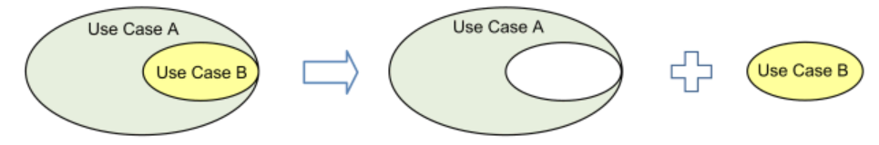
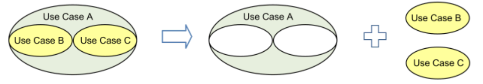
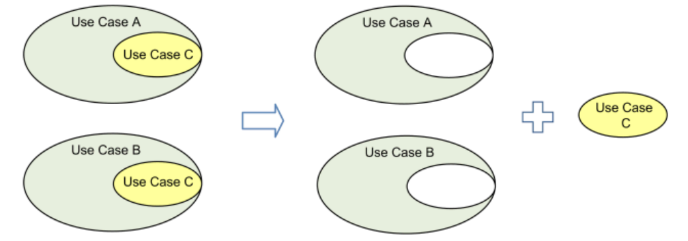
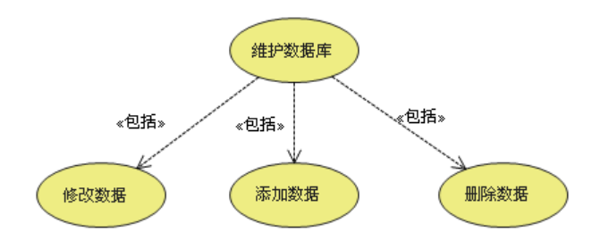
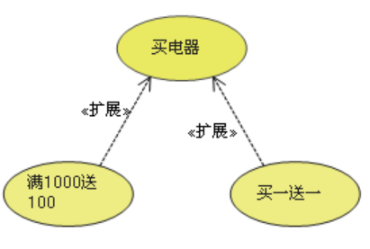
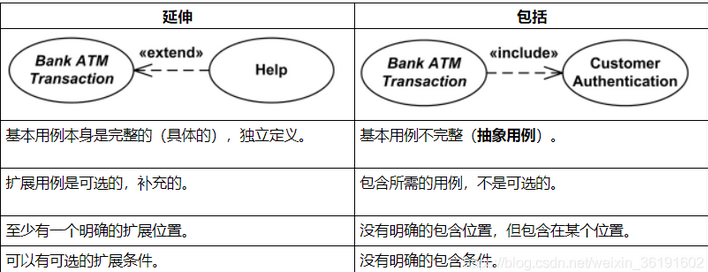
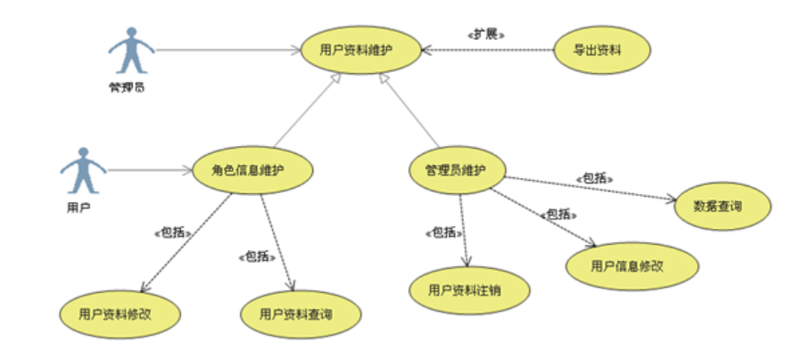

# 实验二 开源软件环境训练

实验目的：

1. 团队分工协作进行软件开源软件环境训练。
2. 继续进行开源项目的分析、研究。

要求：

1. 每组民主产生一名组长（5人一组，可轮换制），负责小组分工、讨论、汇总。
2. 小组工作方式，应合理分工，要留下每个人的工作日志和小组工作总结日志。

实验内容：

## 1.开源软件开源软件环境训练

参考 https://www.learnerhub.net/#/spaces/146/resources-docs/6423
    和 《基于MiniOB的数据库管理系统内核实现实验手册》中实验一
   或 参考这个课程网站，https://www.educoder.net/paths/9i8a7og6   开源软件技术

学会小组git代码提交、分支、合并版本。截图放入实验报告。 参考git文档。
组长将代码上传至开源网站（gitee）、组员建立分支，PR，组长合并分支。 

  相关资料： 
  https://baijiahao.baidu.com/s?id=1687478489959361341   git底层原理
  https://blog.csdn.net/u011473714/article/details/114301206   gitee码云完整使用教程（部署与克隆）
  https://blog.csdn.net/weixin_45296116/article/details/120982586   Git 远程仓库及回滚日志操作
  https://www.liaoxuefeng.com/wiki/896043488029600/900375748016320#0  git多人协作
  https://www.liaoxuefeng.com/wiki/896043488029600/1216289527823648  git多人协作（2）

华为开源训练营网址：
【学习课程地址】openEuler社区开源贡献实践 https://www.hikunpeng.com/zh/learn/courses-list/detail/1551495292913283073
【在线实验地址】openEuler社区开源贡献实践 https://www.hikunpeng.com/zh/learn/experiments/detail/T220720001 
【通关秘籍】openEuler社区贡献在线实验指导 https://www.hikunpeng.com/learn/courses-list/detail/1603573775316582401 

##### 完成人：冯潇宇、刘丽华、蒋裕成

### 1. 克隆原始代码上传至团队的repository

使用Github Desktop完成初始代码的上传，并配置好后续的使用环境。

为repository添加.gitignore，使git只上传源码，不上传项目的构造结果。

### 2. 克隆远程仓库

### 3. 创建并切换分支

### 4. 修改并提交分支

### 5. 合并后删除分支

### 6. 将本地分支推送到远程仓库

### 7. 合并组员分支并解决冲突

## 2.团队协作继续进行开源项目的分析工作

（a）欢迎大家注册登录 软件工程学习社区 https://www.learnerhub.net/#/spaces/146 ，学习前人经验。
     目前该学习社区已经汇聚了国内92所高校的同学，产生了大量的问题讨论和评论，资源众多。

（b）关注其中的“开源软件(小米便签)阅读与维护”专栏， 继续推进自己团队的分析工作。
https://www.learnerhub.net/#/spaces/146  开源软件(小米便签)阅读与维护
   建模语言UML简介

  miniOB社区
  https://developer.aliyun.com/article/1089721 MiniOB 学习笔记
  https://open.oceanbase.com/train  MiniOB 实训营
  
##### 完成人：蒋裕成

配置好项目中.vscode的tasks.json、launch.json、settings.json，方便团队使用vscode + docker进行后续的开发、调试。

代码在docker中通过了构建，并能够正常运行miniob的base功能。

## 3.下面这段求两数的平均值的代码在低年级可给满分，但请结合阿丽亚娜-5型火箭失败的案例，思考它有什么bug?
##### 详见个人报告部分

## 4.团队分工协作，分析第一章PPT中问题

##### 完成人：刘丽华 薛正康 李沛鸣

**1. 1.9 皮卡地里电视台广告售卖系统，系统背景图，了解use case用例图中的include，extend。**

**用例(Use Case)** 就是外部可见的系统功能，对系统提供的服务进行描述。**Include** 和 **Extend** 是两种不同的关系，用来表示一个用例包含或扩展另一个用例的功能。

- **包含(Include)** 表示一个基本用例包含另一个子用例的行为，来把一个较复杂用例所表示的功能分解成较小的步骤，即子用例是基本用例的一部分。包含的用例的执行类似于编程中的子程序调用或宏命令。包含用例取决于所包含的用例的添加，这是**必需的而非可选的**。例如，取款是ATM机的一个基本用例，验证密码是取款的一个子用例，取款必须包含验证密码这个步骤。
    - 用例B从较大的用例A中提取到一个单独的用例中。

    - 用例B和C从较大的用例A中提取到单独的用例中。

    - 用例C是从用例A和B中提取出来的，两个用例都使用UML包含关系重用。

    - 箭头指向：指向分解出来的功能用例。

- **拓展(Extend)** 表示一个扩展用例在某些条件下添加到基本用例的行为中，是指用例功能的延伸，相当于为基础用例提供一个附加功能。扩展用例通常定义可选的行为，这些行为本身并不一定有意义。例如，取款也是ATM机的一个基本用例，收费是取款的一个扩展用例，只有当用户不属于ATM机所属银行时，才会执行收费这个步骤。
    - 扩展关系是扩展用例的泛化关系继续基本用例的行为。扩展用例通过在概念上将附加动作序列插入基本用例序列来实现这一点。这允许扩展用例在基本用例中达到适当的扩展点并且满足扩展条件时继续基本用例的活动序列。当扩展用例活动序列完成时，基本用例继续。
    - 箭头指向：指向基础用例。

下面为Include和Extend的区别，特别的，对于Extend而言，延伸用例并不包含基础用例的内容，基础用例也不包含延伸用例的内容。
- 条件性：泛化中的子用例和include中的被包含的用例会无条件发生，而extend中的延伸用例的发生是有条件的；
- 直接性：泛化中的子用例和extend中的延伸用例为参与者提供直接服务，而include中被包含的用例为参与者提供间接服务。

**2. 1.10 实时系统，分析导致failure原因，改进方案。**

实时系统是一种软件系统，它能够在规定的时间内对外界事件或数据进行响应，并控制生产过程或处理系统的运行。其特点是及时性、可靠性和可预测性。常见的实时系统有：

- 火箭发射控制系统，它需要在火箭飞行过程中实时监测和调整火箭的姿态、速度和轨道。
- 医疗设备，如心脏起搏器、呼吸机等，它们需要根据患者的生理信号实时调节输出参数，保证患者的安全和舒适。
- 工业机器人，它们需要根据传感器和摄像头的输入实时控制机械臂的动作，完成各种复杂的操作。

对于PPT中给出的例子，失败的原因是其中的子系统SRI出现了问题。该系统的厂商仅仅是遵循了给定的规格说明，即在检测到任何异常的情况下，处理器将终止执行。这种情况属于异常被检测到了，但是并没有被适当处理，其原因在于采用了这样的观点：软件发生故障前，认为其是正确的。同时，failure发生的根本原因是客户错误的说明了需求，但是开发人员按照错误的需求构造了高质量的系统（此处的高质量仅针对对应的需求而言）。

对于这种问题，有以下改进方案：

- 改进策略，即假设软件是有故障的，知道应用了目前可接受的最好的实践方法并能够证明其是正确的。
- 尽管需要追求高质量，但在其之前，应当探讨开发人员和客户决策中的设计、测试和维护的含义。即先确定正确的设计方向再追究高质量。既不能被错误的决策影响设计方向，又不能因低质量的系统工程导致决策失误。
- 在软件工程中，须有一个包括所有构建的总体视图，其将各个部件有机结合，综合考虑，以确定各部件的“联系”是否紧密、合适。同时，这也有助于从整体的角度看待工程，便于监测可能存在的问题。

**3. 针对ch2.ppt开头的案例进行研讨，相对传统软件开发过程瀑布模型，原型模型好在哪里？还有其他更好的过程模型吗？**

瀑布模型是一个项目开发架构，开发过程是通过设计一系列阶段顺序展开的，从系统需求分析开始直  到产品发布和维护，每个阶段都会产生循环反馈；原型模型是先借用已有系统作为原型模型，通过“样品”不断改进，使得最后的产品就是用户所需要的。主要是通过向用户提供原型获取用户的反馈，使开发出的软件能够真正反映用户的需求。同时，原型模型采用逐步求精的方法完善原型，使得原型能够“快速”开发，避免了像瀑布模型一样在冗长的开发过程中难以对用户的反馈作出快速的响应。

原型模型有以下优点：

- 开发人员和用户在“原型”上达成一致。这样一来，可以减少设计中的错误和开发中的风险，也减少了对用户培训的时间，而提高了系统的实用、正确性以及用户的满意程度。
- 开发过程中发现问题可以及时修改，不用回退到之前的阶段，也不会出现修改一处导致整个项目发生巨大改变。
- 缩短了开发周期，加快了工程进度。
- 开发成本低。

除了原型模型，还有增量式模型、螺旋模型、敏捷模型等，目前敏捷模型使用较广泛。以下是各种模型的简要介绍。

- 增量式模型（Incremental Model）是一种将软件系统划分为若干个子系统的开发模型，每个子系统按照瀑布模型的过程进行开发，逐步交付给用户。增量式模型的特点是**可以快速提供部分功能给用户**，适用于**需求明确，二次开发的项目**。
- 螺旋模型（Spiral Model）是一种基于风险驱动的迭代式开发模型，每个迭代过程包括四个阶段：制定计划、风险分析、工程实现和客户评估。螺旋模型的特点是**可以有效地管理风险**，适用于**复杂度高，风险大，规模大的项目**。
- 敏捷模型（Agile Model）是一种以人为本，强调团队协作和客户反馈的开发模型，每个迭代过程都包括需求分析、设计、编码和测试等活动，并且持续不断地改进。敏捷模型的特点是**可以快速适应变化**，适用于**小型团队，需求不稳定的项目**。

另外增量式模型、螺旋模型和敏捷模型都属于**迭代式开发方法**，都可以将软件系统划分为多个可交付的部分，并且在每次迭代中都会进行测试和评估。它们之间的区别主要在于：

- 增量式模型更注重按照预先确定好的计划进行开发，而螺旋模型和敏捷模型更注重根据实际情况进行调整。
- 螺旋模型更注重对风险进行识别和控制，而增量式模型和敏捷模型更注重对功能进行实现和验证。
- 敏捷模型更注重与客户保持紧密沟通和合作，而增量式模型和螺旋模型更注重按照预先确定好的计划进行开发。

下面提供三种开发方法的优缺点对比：

| 开发方法 |优点|缺点|
|----------|-|-|
|增量式模型|可以快速提供部分功能给用户，有计划的管理技术风险|需要开放式体系结构，可能会产生设计效果差、开发效率低的情况|
| 螺旋模型 |可以有效地管理风险，适应需求变化|开发周期长，成本高，需要专业的风险分析人员|
| 敏捷模型 |可以快速适应变化，强调团队协作和客户反馈|文档较少，质量难以保证，不适合大型复杂项目|
