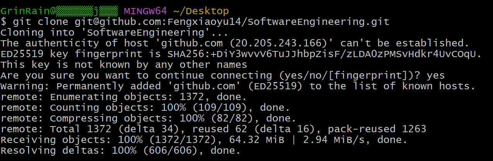
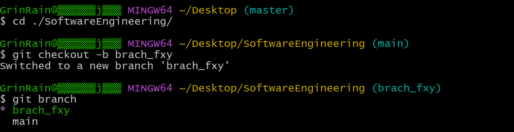
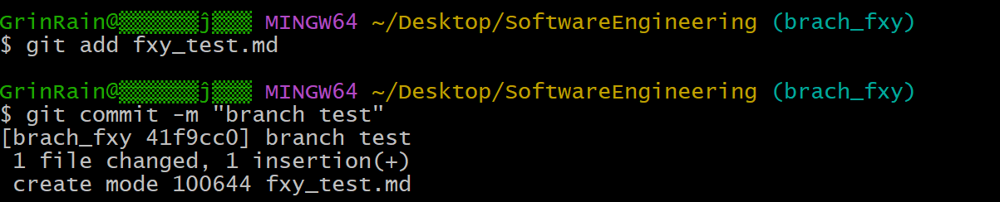
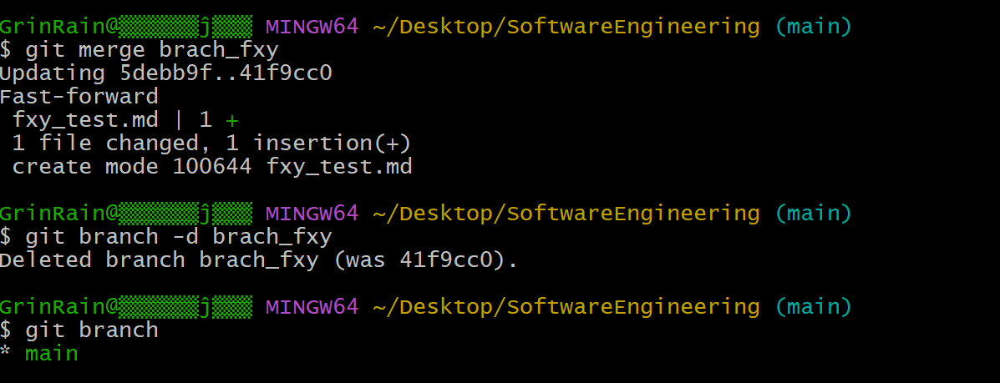
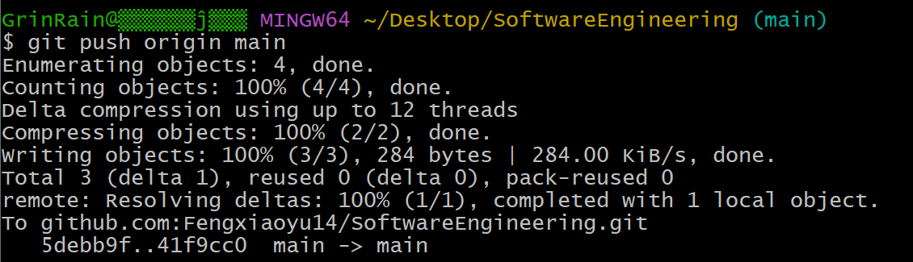
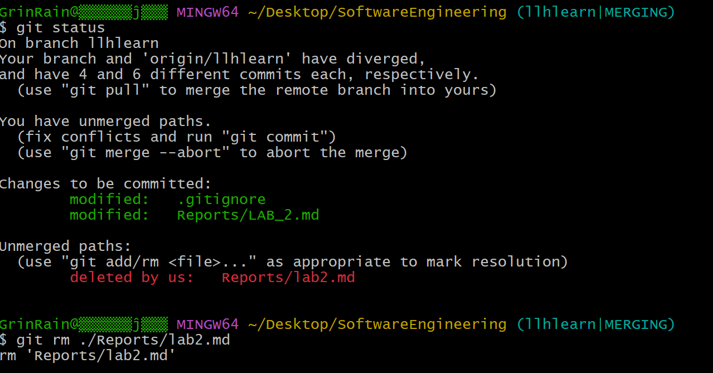
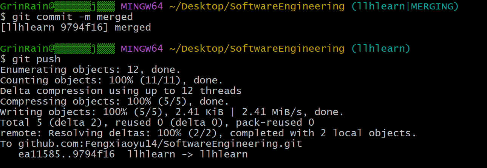
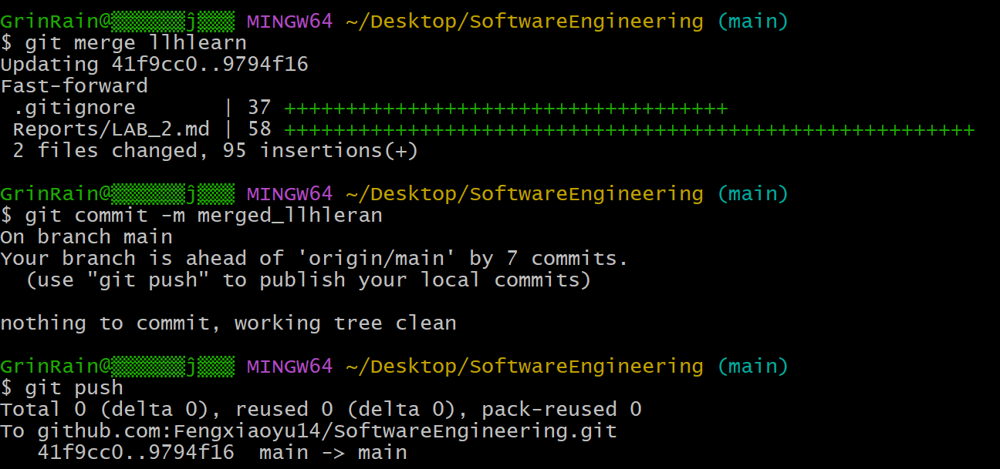

# 实验二 开源软件环境训练

实验目的：

1. 团队分工协作进行软件开源软件环境训练。
2. 继续进行开源项目的分析、研究。

要求：

1. 每组民主产生一名组长（5人一组，可轮换制），负责小组分工、讨论、汇总。
2. 小组工作方式，应合理分工，要留下每个人的工作日志和小组工作总结日志。

实验内容：

## 1.开源软件开源软件环境训练

##### 完成人：冯潇宇、刘丽华、蒋裕成

### 1. 克隆原始代码上传至团队的repository

使用Github Desktop完成初始代码的上传，并配置好后续的使用环境。


为repository添加.gitignore，使git只上传源码，不上传项目的构造结果。


### 2. 克隆远程仓库




### 3. 创建并切换分支




### 4. 修改并提交分支




### 5. 合并后删除分支




### 6. 将本地分支推送到远程仓库




### 7. 合并组员分支并解决冲突








参考 https://www.learnerhub.net/#/spaces/146/resources-docs/6423
    和 《基于MiniOB的数据库管理系统内核实现实验手册》中实验一
   或 参考这个课程网站，https://www.educoder.net/paths/9i8a7og6   开源软件技术

学会小组git代码提交、分支、合并版本。截图放入实验报告。 参考git文档。
组长将代码上传至开源网站（gitee）、组员建立分支，PR，组长合并分支。 

  相关资料： 
  https://baijiahao.baidu.com/s?id=1687478489959361341   git底层原理
  https://blog.csdn.net/u011473714/article/details/114301206   gitee码云完整使用教程（部署与克隆）
  https://blog.csdn.net/weixin_45296116/article/details/120982586   Git 远程仓库及回滚日志操作
  https://www.liaoxuefeng.com/wiki/896043488029600/900375748016320#0  git多人协作
  https://www.liaoxuefeng.com/wiki/896043488029600/1216289527823648  git多人协作（2）

华为开源训练营网址：
【学习课程地址】openEuler社区开源贡献实践 https://www.hikunpeng.com/zh/learn/courses-list/detail/1551495292913283073
【在线实验地址】openEuler社区开源贡献实践 https://www.hikunpeng.com/zh/learn/experiments/detail/T220720001 
【通关秘籍】openEuler社区贡献在线实验指导 https://www.hikunpeng.com/learn/courses-list/detail/1603573775316582401 

## 2.团队协作继续进行开源项目的分析工作

（a）欢迎大家注册登录 软件工程学习社区 https://www.learnerhub.net/#/spaces/146 ，学习前人经验。
     目前该学习社区已经汇聚了国内92所高校的同学，产生了大量的问题讨论和评论，资源众多。

（b）关注其中的“开源软件(小米便签)阅读与维护”专栏， 继续推进自己团队的分析工作。
https://www.learnerhub.net/#/spaces/146  开源软件(小米便签)阅读与维护
   建模语言UML简介

  miniOB社区
  https://developer.aliyun.com/article/1089721 MiniOB 学习笔记
  https://open.oceanbase.com/train  MiniOB 实训营
  
##### 完成人：蒋裕成

配置好项目中.vscode的tasks.json、launch.json、settings.json，方便团队使用vscode + docker进行后续的开发、调试。


代码在docker中通过了构建，并能够正常运行miniob的base功能。

## 3.下面这段求两数的平均值的代码在低年级可给满分，但请结合阿丽亚娜-5型火箭失败的案例，思考它有什么bug?

##### 完成人：刘丽华

```C++
unsigned average(unsigned a, unsigned b){
return (a+b)/2; 
}
```


参考 https://mp.weixin.qq.com/s/vtRAQB6Ber-X95e3JrMpkw
看完后，你还自信自己编过的代码没bug、直接应用于社会没有风险吗？你如何信任团队同伴（其他人）编写的代码？用什么途径能降低代码风险？如何做好软件产品的质量保证（QA，Quality Assurance）？

### （1）

无法处理值溢出的问题，如果（a+b)已经溢出，也就是大于unsigned类型所能表示的最大整数，那么其计算结果将是average（0x80000000U, 0x80000000U）=0。看了这个例子，我不认为我的代码完全没有风险，可以直接用于社会。

###   （2）团队协作开发要做到信任团队成员写的代码，要注意以下几点：

          ①可以适当进行辅助，防止一个模块出现问题对整个项目造成影响，同时要多交流沟通。
          ②互相检查对方的代码，因为据统计一般自查发现的错误只占1/5，同伴审查发现的错误占4/5


###   （3）降低代码风险的途径有：

          ①写每一行代码时思考可能会出现的风险和问题
          ②代码的编写完成后，进行自查和他人的审查，尽量减少错误
          ③测试时选择更好的测试方法，增多测试用例和特殊的用例


​          

###   （4）做好软件产品的质量保证（QA，Quality Assurance）的方法有：

          ①需求文档指标明确，描述详尽，无缺漏、无歧义、无重复，没有无法实现的，没有巨大风险。
          ②设计文档逻辑清晰通畅，交互简单易懂。
          ③写代码时要有合理的框架设计，保证性能的同时底层设计的容错性要高，可扩展可移植性高，兼容性好；
           编码遵循规范，编写完成后进行检查，考虑需求是否完成，算法性能是否最优，是否还有改进的空间；
          ④测试时先分模块进行，各个模块测试都通过后，设计合理的测试方法进行整体测试。
          ⑤评估风险，如需求变动、安全风险等，进行合理的风险预测，在可能发生风险的地方做好多种准备

#####    感想：刘丽华

小错误和故障会导致很大的损失，我们在进行软件工程设计时，一定要多方面谨慎考虑，将风险降到最低


##### 感想：冯潇宇

阿丽亚娜-5型火箭失败的案例也是因为代码中存在问题，导致火箭程序崩溃。这个案例提醒我们，即使是高风险的应用程序，也很可能有漏洞或错误。为了降低代码风险，我们需要采用适当的开发方法和质量保证过程。特别是在关键任务或高风险应用程序中，应该采用更高级别的质量保证措施，如软件测试、代码审查、重复验证等。

对于我们自己编写的代码，我们应该进行严格的测试和代码审查，并且避免简化代码，以确保它们没有漏洞。在团队中，我们可以采用同行评审、代码审查、编码规范和测试等过程来确保代码的质量。此外，采用自动化测试和持续集成也可以帮助降低代码风险，并且保证高质量的软件产品。

##### 感想：蒋裕成

与一般的数学模型不同，程序设计是一个非常复杂的过程，一部分原因是计算机的数据存储形式等底层逻辑限制所带来的，正如这个求平均值的例子。虽然在数学上，这个式子一定是成立的，但是在实际的应用中，我们只能通过有限的bit实现一定值域范围的数据，所以实际上我们使用的无符号数只是模意义下的数。

而一旦没有考虑好这些问题，轻则偶尔使程序崩溃，重则留下注入攻击的漏洞。

要做到自己编过的代码没bug、直接应用于社会没有风险，确实是十分困难的事情。在实际的软件工程中，如果要保证大程序的健壮性，做好软件产品的质量保证，我们要进行充分的测试，合理的审查和文档编写。

降低代码风险的方法有很多，例如：
- 使用静态分析工具检查代码质量和潜在缺陷
- 编写单元测试、集成测试和系统测试来验证代码功能和性能
- 遵循编码规范和风格指南来保持代码一致性和可读性
- 进行代码审查和评审来交流意见和改进建议
- 使用版本控制系统来管理代码变更和历史记录
- 使用持续集成和持续交付工具来自动化构建、测试和部署流程

做好软件产品的质量保证（QA，Quality Assurance）需要有一个完善的流程和团队，包括需求分析、设计评审、开发实现、测试执行、缺陷管理、发布部署等环节，QA需要有一套标准化的方法论和工具集。


## 4.团队分工协作，分析第一章PPT中

##### 完成人：刘丽华 薛正康

1.9 皮卡地里电视台广告售卖系统，系统背景图，了解use case用例图中的include，extend。

1.10 实时系统 
分析导致failure原因，改进方案。

针对ch2.ppt开头的案例进行研讨，相对传统软件开发过程瀑布模型，原型模型好在哪里？还有其他更好的过程模型吗？


4.（1） 皮卡地里电视台广告售卖系统
use case用例图中的include和extend是两种不同的关系，用来表示一个用例包含或扩展另一个用例的功能

- include表示一个基本用例包含另一个子用例的行为，即子用例是基本用例的一部分。例如，取款是ATM机的一个基本用例，验证密码是取款的一个子用例，取款必须包含验证密码这个步骤。
- extend表示一个扩展用例在某些条件下添加到基本用例的行为中，即扩展用例是基本用例的可选部分。例如，取款也是ATM机的一个基本用例，收费是取款的一个扩展用例，只有当用户不属于ATM机所属银行时，才会执行收费这个步骤。

具体分析。。。。。

（2）导致failure原因，改进方案


（3）瀑布模型是一个项目开发架构，开发过程是通过设计一系列阶段顺序展开的，从系统需求分析开始直  到产品发布和维护，每个阶段都会产生循环反馈；原型模型是先借用已有系统作为原型模型，通过“样品”不断改进，使得最后的产品就是用户所需要的。主要是通过向用户提供原型获取用户的反馈，使开发出的软件能够真正反映用户的需求。同时，原型模型采用逐步求精的方法完善原型，使得原型能够“快速”开发，避免了像瀑布模型一样在冗长的开发过程中难以对用户的反馈作出快速的响应。

原型模型有以下优点：

- 开发人员和用户在“原型”上达成一致。这样一来，可以减少设计中的错误和开发中的风险，也减少了对用户培训的时间，而提高了系统的实用、正确性以及用户的满意程度。
- 开发过程中发现问题可以及时修改，不用回退到之前的阶段，也不会出现修改一处导致整个项目发生巨大改变。
- 缩短了开发周期，加快了工程进度。
- 开发成本低。

除了原型模型，还有增量式模型、螺旋模型、敏捷模型等，目前敏捷模型使用较广泛。以下是各种模型的简要介绍。

- 增量式模型（Incremental Model）是一种将软件系统划分为若干个子系统的开发模型，每个子系统按照瀑布模型的过程进行开发，逐步交付给用户。增量式模型的特点是可以快速提供部分功能给用户，适用于需求明确，二次开发的项目。
- 螺旋模型（Spiral Model）是一种基于风险驱动的迭代式开发模型，每个迭代过程包括四个阶段：制定计划、风险分析、工程实现和客户评估。螺旋模型的特点是可以有效地管理风险，适用于复杂度高，风险大，规模大的项目。
- 敏捷模型（Agile Model）是一种以人为本，强调团队协作和客户反馈的开发模型，每个迭代过程都包括需求分析、设计、编码和测试等活动，并且持续不断地改进。敏捷模型的特点是可以快速适应变化，适用于小型团队，需求不稳定的项目。

另外增量式模型、螺旋模型和敏捷模型都属于迭代式开发方法，都可以将软件系统划分为多个可交付的部分，并且在每次迭代中都会进行测试和评估。它们之间的区别主要在于：

- 增量式模型更注重按照预先确定好的计划进行开发，而螺旋模型和敏捷模型更注重根据实际情况进行调整。
- 螺旋模型更注重对风险进行识别和控制，而增量式模型和敏捷模型更注重对功能进行实现和验证。
- 敏捷模型更注重与客户保持紧密沟通和合作，而增量式模型和螺旋。

下面提供三种开发方法的优缺点对比：

<style>
table th:first-of-type {
    width: 15%;
}
table th:nth-of-type(2) {
    width: 45%;
}
table th:nth-of-type(3) {
    width: 45%;
}
</style>

|开发方法|优点|缺点|
|------------|----|---|
|增量式模型|可以快速提供部分功能给用户，有计划的管理技术风险|需要开放式体系结构，可能会产生设计效果差、开发效率低的情况|
|螺旋模型|可以有效地管理风险，适应需求变化|开发周期长，成本高，需要专业的风险分析人员|
|敏捷模型|可以快速适应变化，强调团队协作和客户反馈|文档较少，质量难以保证，不适合大型复杂项目|


要求：
（1）每个人针对任务3填写自己的感想。
（2）组长将汇总后小组调研报告（注明每部分的贡献者）和小组项目分析工作进度等打包提交。

