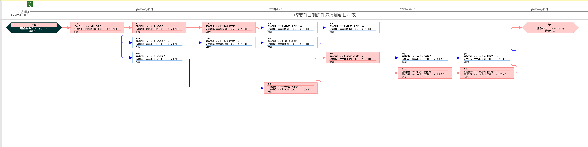

# 实验三 项目计划、CASE工具调研分析

实验目的：

1. 团队分工协作进行软件项目计划，活动图的计算。
2. 掌握几种CASE工具软件。
3. 小组继续分工协作进行开源项目的分析、研究。
   

要求：
1. 每组组长（可轮换制），负责小组分工、讨论、汇总。
2. 小组工作方式，应合理分工，将每个人的工作日志和小组进度报告等文档保存到共享平台上。

实验内容：
## 1. 活动图练习。参考所给的资料。

针对课本练习题3(p98)的软件开发项目活动图，画出每活动的最早开始时间、最晚开始时间，整个工期和关键路径。

## 2. CASE（Computer-Aided Software Engineering,计算机辅助软件工程）工具调研及应用

CASE工具举例：（不限于此）
Microsoft Visio; Microsoft Project; Product Studio; Visual SourceSafe；TFS
Smartdraw，MagicDraw
Rational Rose
Sybase PowerDesigner 
Enterprise Architect
StarUML， PlantUML
ModelMake
Umbrello TOgether
UMLStudio
Visual Paradigm for UML
Marvel
CodeLogic
ArchStudio (Eclipse 插件)
Junit、MI WinRunner/ LoadRunner
Apache JMeter
git
CVS
ClearCase 

推荐两款开源软件:
https://staruml.io/    StarUML
https://github.com/staruml

http://www.sonarqube.org  SonarQube  
https://github.com/SonarSource/sonarqube

任务：
（1）小组分工选择几种工具软件，写出它们的用途、技术特点。
（2）使用工具(如Project）或自己编写程序（如下）自动化求关键路径（以ch3,P98习题3为例）。
 要求功能：
 能输入，建立各个活动图。（计算基础：树、图等二维结构）
 能存储活动图。
 能进行关键路径的计算和展示。

### 工具调研

**完成人：冯潇宇、蒋裕成**

1. Microsoft Visio 

   用途：Microsoft Visio 是一个流程图绘制工具，可以用来制作各种图表，例如流程图、组织结构图、网络拓扑图等。 

   技术特点：可视化图形界面，提供了丰富的模板和形状，支持多种文件格式导入导出，易于协作和共享。

2. Microsoft Project 

   用途：Microsoft Project 是一款项目管理软件，用于帮助项目经理规划、分配资源、跟踪项目进度、管理预算等。 

   技术特点：提供丰富的项目管理工具，如甘特图、资源分配表等，支持多项目管理，可与其他Microsoft Office套件集成。

3. Product Studio 

   用途：Product Studio 是一个产品管理软件，用于追踪和管理产品开发过程中的问题、任务和要求。 

   技术特点：灵活的工作项跟踪系统，可配置的查询和报表，提供了多种角色和工作流程模型。

4. Visual SourceSafe 

   用途：Visual SourceSafe 是一个版本控制系统，用于管理多人协作开发的软件代码。

   技术特点：集中式版本控制，支持多个项目和用户，具有权限控制和文件锁定功能，支持文件比较和版本历史查看。

5. TFS (Team Foundation Server) 

   用途：TFS 是一个集成的应用生命周期管理（ALM）工具，提供了版本控制、工作项跟踪、持续集成、自动构建、测试和发布等功能。 

   技术特点：支持敏捷开发方法，与Visual Studio集成，提供Web界面和REST API，可扩展和集成其他工具。

6. SmartDraw 

   用途：SmartDraw 是一个图形绘制工具，用于创建流程图、组织结构图、项目图等。 

   技术特点：拥有丰富的模板和图形库，支持自动对齐和连接，支持多种文件格式导入导出。

7. MagicDraw 

   用途：MagicDraw 是一个强大的UML建模工具，用于创建和分析软件设计模型。

   技术特点：支持UML 2.x标准，提供多种图表类型，具有代码生成和逆向工程功能，支持模型验证和模型转换。

8. Rational Rose 

   用途：Rational Rose 是一款UML建模工具，用于创建、分析和维护软件设计模型。 

   技术特点：支持UML标准，提供多种建模语言，具有代码生成和逆向工程功能，支持模型合并和版本控制。

9. Sybase PowerDesigner 

   用途：PowerDesigner 是一个企业级建模工具，用于创建和管理数据模型、业务模型.

   技术特点：支持数据建模、业务建模和架构建模，支持多种数据库和建模语言，具有版本控制和多用户协作功能，提供丰富的报表和图表功能。

10. Enterprise Architect 

    用途：Enterprise Architect 是一个全面的建模、可视化和设计工具，支持业务流程、系统建模、软件开发和企业架构等领域。 技术特点：支持UML、BPMN、SysML等建模语言，具备代码生成和逆向工程功能，支持多用户协作，可与其他工具集成。
    
    测试中发现，Enterprise Architect的UML逆向工程功能效果较好，可以根据C/C++代码生成UML图。
    

11. StarUML 

    用途：StarUML 是一个开源UML建模工具，用于创建和管理软件设计模型。 

    技术特点：支持UML 2.x标准，提供丰富的图表类型，具有代码生成和逆向工程功能，支持模板和扩展插件。
    
    StarUML已经多年未更新。（虽然最近StarUML开始恢复更新，但是没有大的变化）
    
    测试中发现，StarUML的UML逆向工程对C/C++代码的支持效果不好，基本不能用来生成UML图。
    
    

12. PlantUML 

    用途：PlantUML 是一个开源的文本到UML图形转换工具，可以快速生成UML图表。

    技术特点：基于文本的简洁语法，支持多种UML图表类型，可集成到各种文档编辑器和开发环境中。
    
    由于PlantUML是一种UML语法，他本身没有UML正/逆向工程的能力，但是有一些编辑器/IDE支持PlantUML正向工程的插件（根据UML生成代码），例如vscode。

13. ModelMaker 

    用途：ModelMaker 是一款UML建模和代码生成工具，用于创建和管理软件设计模型。 

    技术特点：支持UML标准，具备代码生成和逆向工程功能，支持多种编程语言，提供模板和宏功能。

14. Umbrello 

    用途：Umbrello 是一款开源的UML建模工具，用于创建和分析软件设计模型。 

    技术特点：支持UML 2.x标准，提供多种图表类型，具有代码生成和逆向工程功能，支持多种文件格式导入导出。
    
    测试中发现，Umbrello的UML逆向工程对C/C++代码的支持效果不好，基本不能用来生成UML图。
    
    

15. TOgether 

    用途：TOgether 是一款UML建模和代码生成工具，用于创建和管理软件设计模型。 

    技术特点：支持UML标准，具备代码生成和逆向工程功能，支持多种编程语言，提供模板和宏功能。

16. UMLStudio 

    用途：UMLStudio 是一个UML建模工具，用于创建和分析软件设计模型。 

    技术特点：支持UML标准，提供多种图表类型，具有代码生成和逆向工程功能，支持模型验证和模型转换。

17. Visual Paradigm for UML 

    用途：Visual Paradigm for UML 是一个UML建模工具，用于创建和分析软件设计模型。 

    技术特点：支持UML 2.x标准，提供多种图表类型，具有代码生成和逆向工程功能，支持模型验证和模型转换。
    
    测试中发现，Visual Paradigm的UML逆向工程功能效果较好，可以根据C/C++代码生成UML图。但是Visual Paradigm的UML导出不太便捷，而且对于大型工程的UML，自动排版难以使用,一旦图中框图元素太多，一般就不太能整理出美观的排版。
    
    

18. Marvel 

    用途：Marvel 是一个在线原型设计和协作平台，用于创建交互式的应用程序原型。 

    技术特点：支持多种设计工具导入，提供实时协作功能，具有丰富的UI组件库，支持用户反馈和评论功能。

19. CodeLogic 

    用途：CodeLogic 是一款代码可视化和分析工具，用于分析软件代码的结构和依赖关系。 

    技术特点：支持多种编程语言，提供代码结构图和依赖图，支持代码质量分析和优化建议。

20. ArchStudio (Eclipse 插件) 

    用途：ArchStudio 是一个基于Eclipse的软件架构设计工具，用于创建和管理软件架构模型。 

    技术特点：支持xADL架构描述语言，提供组件和连接器建模，支持模型验证和模型转换。

21. JUnit 

    用途：JUnit 是一个Java编程语言的单元测试框架，用于编写和执行单元测试用例。 

    技术特点：易于编写和执行测试用例，支持测试套件和测试夹具，可与其他Java开发工具集成。

22. MI WinRunner/LoadRunner 

    用途：WinRunner 是一个功能测试工具，用于自动化测试应用程序。LoadRunner 是一个性能测试工具，用于模拟大量用户并发访问应用程序。 

    技术特点：支持多种应用类型和平台，提供录制和回放功能，具有丰富的测试报告和分析功能。

23. Apache JMeter 

    用途：Apache JMeter 是一个开源性能测试工具，用于测试应用程序的响应时间和吞吐量。

     技术特点：支持多种协议和应用类型，具有可扩展的插件架构，提供图形界面和命令行操作方式。

24. Git 

    用途：Git 是一个分布式版本控制系统，用于管理多人协作开发的软件代码。 

    技术特点：分布式架构，支持离线工作，具有高效的分支和合并功能，支持大型项目和多用户协作。

25. CVS (Concurrent Versions System) 

    用途：CVS 是一个集中式版本控制系统，用于管理多人协作开发的软件代码。

    技术特点：集中式架构，支持多个项目和用户，具有权限控制和文件锁定功能，支持文件比较和版本历史查看。

26. ClearCase 

    用途：ClearCase 是一个版本控制系统，用于管理多人协作开发的软件代码。 

    技术特点：支持集中式和分布式架构，具有分支和合并功能，支持文件系统和文件级的版本控制，可与其他开发工具集成

#### GanttProject简介

GanttProject是一款开源的项目管理软件，其主要用途是帮助用户规划、管理和控制项目进度，包括时间和资源的分配、任务分配、里程碑和关键路径等。以下是GanttProject的技术特点：

1. 支持Gantt图和PERT图：GanttProject支持使用Gantt图和PERT图两种方法来可视化项目计划。用户可以通过拖动和放置来安排任务、设置依赖关系和优化资源分配等。
2. 支持导入和导出Microsoft Project文件：GanttProject与Microsoft Project文件格式兼容，可以将项目计划从Microsoft Project导入到GanttProject中，也可以将GanttProject文件导出为Microsoft Project文件格式。
3. 轻量级和跨平台：GanttProject是一个轻量级应用程序，具有快速启动和响应时间的优点。它也是跨平台的，可以在Windows、Mac OS和Linux等操作系统上运行。
4. 开源软件：GanttProject是一款开源软件，允许用户自由地使用、修改和分发软件源代码。这使得GanttProject具有灵活性和可定制性，可以根据特定的需求进行修改和扩展。
5. 详细的任务管理功能：GanttProject提供了丰富的任务管理功能，包括任务名称、起始日期、结束日期、持续时间、优先级、进度等信息。它还可以通过颜色和符号来显示任务状态。

总之，GanttProject是一款功能强大、易于使用的项目管理软件，它可以帮助用户规划和跟踪项目的进度和资源分配，以实现项目的顺利完成。

##### GanttProject软件界面

#### Microsoft Project简介

Microsoft Project是一款流行的项目管理软件，其主要用途是帮助用户规划、管理和控制项目进度、资源和预算等方面。以下是Microsoft Project的技术特点：

1. 支持Gantt图和PERT图：Microsoft Project支持使用Gantt图和PERT图两种方法来可视化项目计划。用户可以通过拖动和放置来安排任务、设置依赖关系和优化资源分配等。
2. 集成式项目管理：Microsoft Project可以集成式地管理项目的进度、资源和预算等方面。用户可以创建和管理任务、分配资源、追踪项目进度、生成报告等。
3. 支持协作：Microsoft Project支持协作，可以让多个用户共同编辑同一个项目，共享项目文件、任务分配、资源分配等信息。此外，它还支持与Microsoft Teams等协作平台的集成。
4. 预测和分析功能：Microsoft Project提供了一些预测和分析功能，可以帮助用户优化项目计划，分析风险和成本，进行决策等。
5. 灵活的定制：Microsoft Project具有灵活的定制功能，用户可以根据自己的需求进行个性化的配置和修改。例如，用户可以创建自定义的字段、表格、过滤器等。
6. 与其他Microsoft Office应用程序的集成：Microsoft Project可以与其他Microsoft Office应用程序（如Excel、Word、Outlook）进行集成，用户可以从中导入和导出数据，共享信息等。

总之，Microsoft Project是一款功能丰富、灵活性高的项目管理软件，它可以帮助用户规划和跟踪项目的进度和资源分配，以实现项目的顺利完成。同时，其协作、分析、定制等功能也使得用户能够更好地管理和控制项目。

#### 使用Microsoft Project建立任务、绘制活动图并自动化求关键路径

1. 填写任务名称、工期、前置任务。软件自动生成甘特图

2. 查看活动图视图，红色的路径即为关键路径

## 2. 继续团队协作继续进行开源项目的分析工作

参照 小米便签开源代码的泛读报告（模板）.doc ，填写丰富开源软件分析报告。

要求：
（1）组长将汇总后小组调研报告（注明每部分的贡献者）、任务2自动生成的截图和开源项目分析工作进度等打包提交。
（2）每个人填写实验报告，将任务1中活动图的每一条活动路径，标出最早开始时间、最晚开始时间，时间差，整个项目工期和关键路径。思考关键路径能有多条吗？还有比关键路径更长的路径吗？
